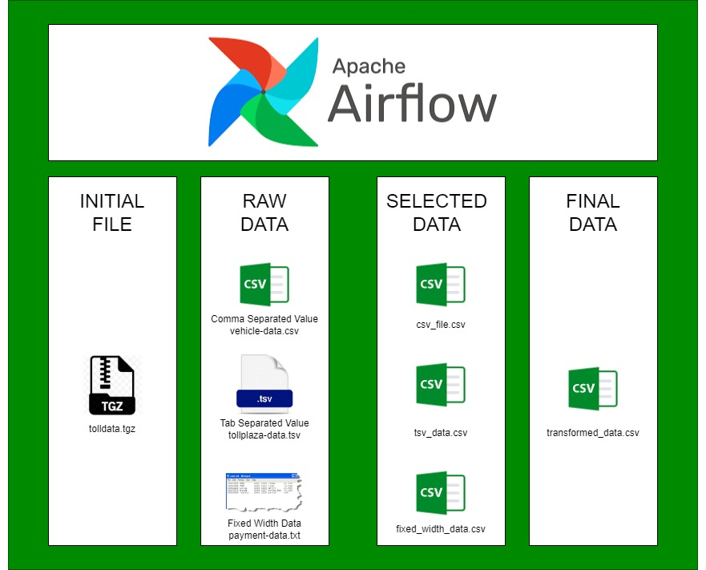
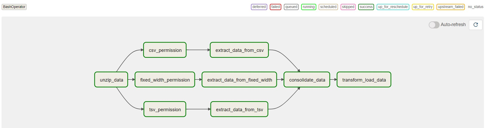

# Learning Airflow
## introduction
In this project, data is extracted from CSV, TSV, and fixed-width raw data files, transformed, merged, and stored in a single CSV-formatted file. Besides learning Apache Airflow, this project is also used as an opportunity to sharpen Linux shell scripting skills. Each task in this project is implemented using the BashOperator().

All the project files are organized within the dags directory
## dags
The project's Directed Acyclic Graph (DAG) represents the workflow and execution order of tasks.

